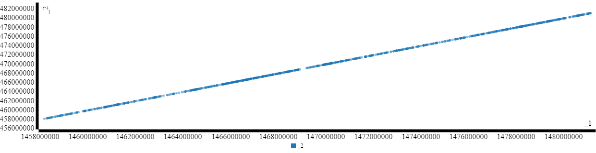
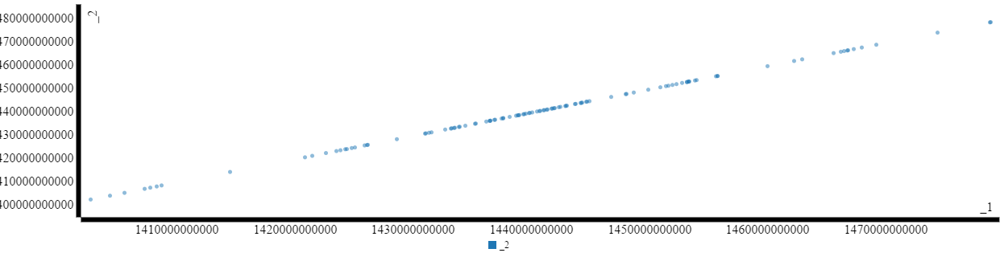
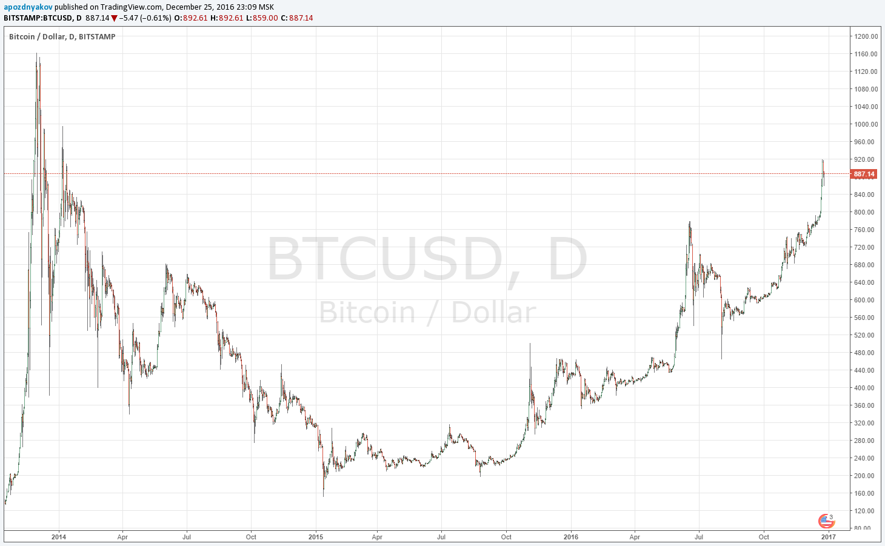
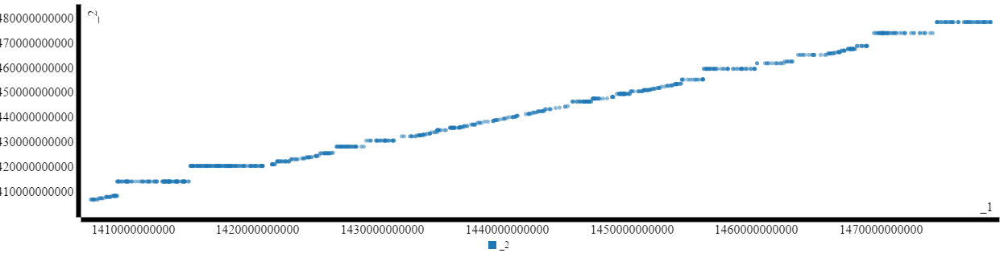
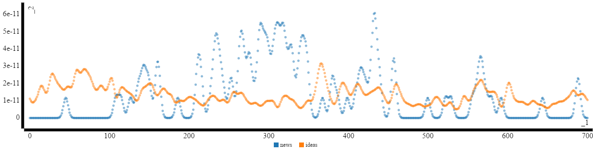
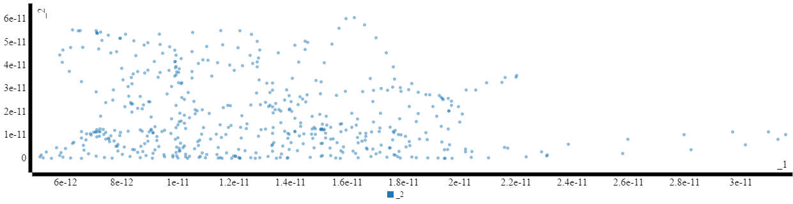
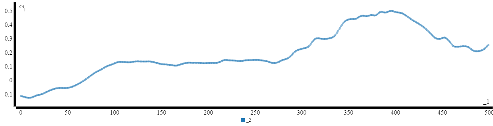
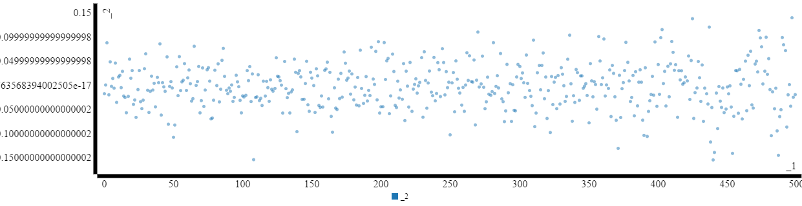

# Big Data
# Pipelines, Technologies & Roles


***
# Spark


```scala
import org.apache.spark.sql.SQLContext
import org.apache.spark.mllib.rdd.RDDFunctions._
import scala.util.{Try, Success, Failure}
import java.sql.Timestamp

val sqlContext = new SQLContext(sparkContext)
import sqlContext.implicits._
```

<!--
><pre>
> import org.apache.spark.sql.SQLContext
> import org.apache.spark.mllib.rdd.RDDFunctions._
> import scala.util.{Try, Success, Failure}
> import java.sql.Timestamp
> sqlContext: org.apache.spark.sql.SQLContext = org.apache.spark.sql.SQLContext@8de44bd
> import sqlContext.implicits._
> <pre>
> -->

***
# TradingView Ideas on BTCUSD

4000 опубликованных идей получены примерно так:

    сurl -s "https://www.tradingview.com/chart/
    		?stream=bitcoin&time=all&s=0&l=1000"
    сurl -s "https://www.tradingview.com/chart/
    		?stream=bitcoin&time=all&s=1000&l=1000"
    сurl -s "https://www.tradingview.com/chart/
    		?stream=bitcoin&time=all&s=2000&l=1000"
    сurl -s "https://www.tradingview.com/chart/
    		?stream=bitcoin&time=all&s=3000&l=1000"

***
## Parse Time


```scala
val btcIdeas = 
         sparkContext.textFile("data/1000_1_BTC_ideas.json")
  .union(sparkContext.textFile("data/1000_2_BTC_ideas.json"))
  .union(sparkContext.textFile("data/1000_3_BTC_ideas.json"))
  .union(sparkContext.textFile("data/1000_4_BTC_ideas.json"))
```
<!--
><pre>
> btcIdeas: org.apache.spark.rdd.RDD[String] = UnionRDD[10] at union at <console>:70
> <pre>
-->

```scala
import java.lang.Double
val times = btcIdeas
  .flatMap(_.split("data-timestamp"))
  .map(_.split("\\\"")(1))
  .map(x => x.substring(0, x.length - 1))
  .flatMap(x => Try(Double.parseDouble(x)).toOption)
```


><pre>
> times: org.apache.spark.rdd.RDD[Double] = MapPartitionsRDD[14] at flatMap at <console>:73


***

На шкале времени опубликованные по биткоинам идеи выглядят так:

```scala
ScatterChart(times.map(x => (x,x)).collect)
```

<!--
><pre>
> res9: notebook.front.widgets.charts.ScatterChart[Array[(Double, Double)]] = <ScatterChart widget>
-->

> 

***
## Время первой и последней

```scala
val t = Seq(times.collect.min, times.collect.max)
  .map(x => new Timestamp(x.toLong * 1000));
```

><pre>
> t: Seq[java.sql.Timestamp] = 
>       List(2014-07-28 19:30:18.0, 2016-12-07 19:59:13.0)

***

# Yahoo News

В `data/yahoo.txt` - манипуляциями с html в текстовом редакторе собраны новости по BTCUSD в виде:

    http://finance.yahoo.com/news/exclusive-mona-el-isa-google-171602365.html
    http://finance.yahoo.com/news/exclusive-mona-el-isa-google-161420691.html
    http://finance.yahoo.com/news/payments-marijuana-industry-blockchain-increase-163357208.html
    http://finance.yahoo.com/news/youre-money-ny-judge-rules-162025300.html
    ...

```scala
val btcNewsUrls = sparkContext.textFile("data/yahoo.txt")
```

<!--
><pre>
> btcNewsUrls: org.apache.spark.rdd.RDD[String] = data/yahoo.txt MapPartitionsRDD[17] at textFile at <console>:67
-->

***

Получим времена публикации новостей:

```scala
import java.text.SimpleDateFormat
val dateFormatter = 
	new SimpleDateFormat("yyyy-MM-dd'T'HH:mm:ss.SSS'Z'")
val yahooTimes = btcNewsUrls
  .flatMap(x => Try{
    val s = scala.io.Source.fromURL(x, "utf-8")
    val res = s.getLines
    	        .filter(_.contains("datetime"))
                .take(1)
                .toList
    s.close()
    res
  }.toOption)
  .flatMap(x => x)
  .flatMap(x => "datetime=\"(.*?)\"".r
                .findFirstMatchIn(x)
                .map(_.group(1)))
  .map(dateFormatter.parse(_))
  .map(_.getTime)
  .collect
```

***
<!--
><pre>
> yahooTimes: Array[Double] = Array(1.478873762E12, 1.47878366E12, 1.474377625E12, 1.469172833E12, 1.467970882E12, 1.467285822E12, 1.466784686E12, 1.466699103E12, 1.466443931E12, 1.46616087E12, 1.465572075E12, 1.462895072E12, 1.462191844E12, 1.45995792E12, 1.455724905E12, 1.455724905E12, 1.455617612E12, 1.45397749E12, 1.453806612E12, 1.453371609E12, 1.453322029E12, 1.453322029E12, 1.45313169E12, 1.45313169E12, 1.452768008E12, 1.452248441E12, 1.45190229E12, 1.451560839E12, 1.451381972E12, 1.450887469E12, 1.449855089E12, 1.448623642E12, 1.448022344E12, 1.44795022E12, 1.446748189E12, 1.444919863E12, 1.444723331E12, 1.444660376E12, 1.444295927E12, 1.444204444E12, 1.444123428E12, 1.443772757E12, 1.443690335E12, 1.442995674E12, 1.442909659E12, 1.442824725E12, 1.442479224E12, 1.442327258E12, 1.4...

***
-->

На шкале времени yahoo новости по биткоинам выглядят так:

```scala
ScatterChart(yahooTimes.map(x => (x,x)))
```

<!--
><pre>
> res14: notebook.front.widgets.charts.ScatterChart[Array[(Double, Double)]] = <ScatterChart widget>
-->



***

## Время первой и последней

```scala
val t = Seq(yahooTimes.min, yahooTimes.max)
  .map(x => new Timestamp(x.toLong));
```


><pre>
> t: Seq[java.sql.Timestamp] = 
>       List(2014-06-13 18:02:44.0, 2016-11-11 17:16:02.0)

***

# Сам BTCUSD в это время



***

# Compare Ideas and News

```scala
val newsTimes = yahooTimes.sorted
val ideasTimes = times.map(_ * 1e3).collect.sorted
```

<!--
><pre>
> newsTimes: Array[Double] = Array(1.402668164E12, 1.404309181E12, 1.405528217E12, 1.407251318E12, 1.407760191E12, 1.408277639E12, 1.408718124E12, 1.414511631E12, 1.420800438E12, 1.421432953E12, 1.422633223E12, 1.423489141E12, 1.423838937E12, 1.424265034E12, 1.424343008E12, 1.424783196E12, 1.425035527E12, 1.425905464E12, 1.426083723E12, 1.426162721E12, 1.428581968E12, 1.431001563E12, 1.43109034E12, 1.431358289E12, 1.431527275E12, 1.432729179E12, 1.433153514E12, 1.433256767E12, 1.433416825E12, 1.433493452E12, 1.433839869E12, 1.433927704E12, 1.434368311E12, 1.435220818E12, 1.435307102E12, 1.436170775E12, 1.436436416E12, 1.436520077E12, 1.436536313E12, 1.436884105E12, 1.43695033E12, 1.437465023E12, 1.437572223E12, 1.437639285E12, 1.438173761E12, 1.43867558E12, 1.438849314E12, 1.438873228E12,...
-->

***

## Выведем новости и идеи на одном графике.

```scala
val both = for {
  newsPair <- newsTimes.sliding(2)
  ti <- ideasTimes if ti >= newsPair(0) && ti < newsPair(1)
} yield (ti, newsPair(1))
// select only 22% to be able to plot scatter chart
ScatterChart(both.filter(x => scala.math.random > 0.78).toSeq)
```

<!--
><pre>
> both: Iterator[(Double, Double)] = empty iterator
> res18: notebook.front.widgets.charts.ScatterChart[Seq[(Double, Double)]] = <ScatterChart widget>
-->



Рост вверх - новость, рост вправо - идея.

***

# Statistics

Сравнивать точки во времени не совсем понятно как.
Будем сравнивать плотности вероятностей.

```scala
import org.apache.spark.mllib.stat.KernelDensity
import org.apache.spark.rdd.RDD

def myKernelDensity(arr: Array[Double]): KernelDensity = {
  val data = sc.parallelize(arr)
  new KernelDensity()
    .setSample(data)
    .setBandwidth(3e8)
}

val kdi = myKernelDensity(ideasTimes)
val kdn = myKernelDensity(newsTimes)

// Find density estimates for the given values
// 14100 to 14800 * 1e8 - time: 06 Sep 2014 - 24 Nov 2016
val densitiesi = kdi.estimate(
		    (14100 to 14800).map(_ * 1e8).toArray)
val densitiesn = kdn.estimate(
		    (14100 to 14800).map(_ * 1e8).toArray)
```

<!--
***

><pre>
> import org.apache.spark.mllib.stat.KernelDensity
> import org.apache.spark.rdd.RDD
> myKernelDensity: (arr: Array[Double])org.apache.spark.mllib.stat.KernelDensity
> kdi: org.apache.spark.mllib.stat.KernelDensity = org.apache.spark.mllib.stat.KernelDensity@4da2b509
> kdn: org.apache.spark.mllib.stat.KernelDensity = org.apache.spark.mllib.stat.KernelDensity@62c4425f
> densitiesi: Array[Double] = Array(1.1146228791490883E-11, 1.0171144556767895E-11, 9.431902052633709E-12, 9.03117077264955E-12, 8.987450461187679E-12, 9.246506257924815E-12, 9.728004827836442E-12, 1.0382493547871159E-11, 1.1221585286656958E-11, 1.2295129293382621E-11, 1.3623327411218384E-11, 1.5127735749367217E-11, 1.66131886394667E-11, 1.7821426524240194E-11, 1.852800763348134E-11, 1.862586601992073E-11, 1.8153759234420768E-11, ...
-->

***

## На графике

```scala
val newsAndIdeasForChart = (densitiesn zip densitiesi)
  .zipWithIndex
  .flatMap{ 
    case ((x,y), i) => Seq((i, x, "news"), (i, y, "ideas"))
  }
ScatterChart(newsAndIdeasForChart, 
             fields=Some(("_1", "_2")),
             groupField=Some("_3"),
             maxPoints=2000)
```

<!--
><pre>
> newsAndIdeasForChart: Array[(Int, Double, String)] = Array((0,1.2662565702733882E-15,news), (0,1.1146228791490883E-11,ideas), (1,2.8821591130623787E-16,news), (1,1.0171144556767895E-11,ideas), (2,5.870849470826628E-17,news), (2,9.431902052633709E-12,ideas), (3,1.0701744056225083E-17,news), (3,9.03117077264955E-12,ideas), (4,1.745697164496258E-18,news), (4,8.987450461187679E-12,ideas), (5,2.5482258630041643E-19,news), (5,9.246506257924815E-12,ideas), (6,3.328571420339658E-20,news), (6,9.728004827836442E-12,ideas), (7,3.8906889278102674E-21,news), (7,1.0382493547871159E-11,ideas), (8,4.069512709416707E-22,news), (8,1.1221585286656958E-11,ideas), (9,3.808945192950954E-23,news), (9,1.2295129293382621E-11,ideas), (10,3.1901633940729214E-24,news), (10,1.3623327411218384E-11,ideas), (11,2.3909...
-->




***

## В другом виде

```scala
ScatterChart(
  (densitiesi zip densitiesn).filter(_._2 >= 1e-13)
)
```

<!--
><pre>
> res53: notebook.front.widgets.charts.ScatterChart[Array[(Double, Double)]] = <ScatterChart widget>
-->



***

# Correlation

```scala
import org.apache.spark.mllib.linalg._
import org.apache.spark.mllib.stat.Statistics
```

<!--
><pre>
> import org.apache.spark.mllib.linalg._
> import org.apache.spark.mllib.stat.Statistics
-->


```scala
val correlation: Double = Statistics.corr(
  sc.parallelize(densitiesi),
  sc.parallelize(densitiesn),
  "spearman"
)
```


><pre>
> correlation: Double = -0.10929748013913299

***
## Отбрасывая историю

Отбросим начало истории, $2 / 7$

```scala
val correlation: Double = Statistics.corr(
  sc.parallelize(densitiesi drop 200),
  sc.parallelize(densitiesn drop 200),
  "spearman"
)
```


><pre>
> correlation: Double = 0.12755330772717519

Уже лучше. Отбросим ещё $2 / 7$

```scala
val correlation: Double = Statistics.corr(
  sc.parallelize(densitiesi drop 400),
  sc.parallelize(densitiesn drop 400),
  "spearman"
)
```


><pre>
> correlation: Double = 0.4965642120085375

***

## Отбрасывая историю (2)

```scala
val correlations = for (i <- 1 to 500) yield Statistics.corr(
    sc.parallelize(densitiesi drop i),
    sc.parallelize(densitiesn drop i),
    "spearman"
  )
```

<!--
><pre>
> correlations: scala.collection.immutable.IndexedSeq[Double] = Vector(-0.10991536134330307, -0.11095279672674485, -0.11259142422390796, -0.1144613235800899, -0.11641453769156956, -0.11829731683201414, -0.12003017818538125, -0.12112670358409999, -0.12179638089980019, -0.12199426875321215, -0.12150861571812235, -0.1201087873722684, -0.11806764689885932, -0.11543977076678519, -0.11254447218778885, -0.10957969928545526, -0.10676988503148042, -0.10432371853322593, -0.10235652168140029, -0.10075357981760356, -0.09954870907898057, -0.09834485751238742, -0.0966249750525487, -0.09428000670447927, -0.09123500923069196, -0.08782251252007198, -0.08442649429823215, -0.08111654049144577, -0.07790910767550718, -0.07480044423401483, -0.07178516671286547, -0.06886704470718552, -0.06604938448044612, -0.06...
-->


```scala
ScatterChart(correlations.toArray)
```

<!--
><pre>
> res39: notebook.front.widgets.charts.ScatterChart[Array[Double]] = <ScatterChart widget>
-->




***

# Убедимся, что мы себя не сильно обманываем (?)

```scala
import scala.util.Random
val correlationsBad = for (i <- 1 to 500) yield Statistics.corr(
    sc.parallelize(densitiesi drop i),
    sc.parallelize(Random.shuffle(densitiesi drop i)),
    "spearman"
  )
```

```scala
ScatterChart(correlationsBad.toArray)
```



***

# Overfitting


***

# Train/Test set


***


